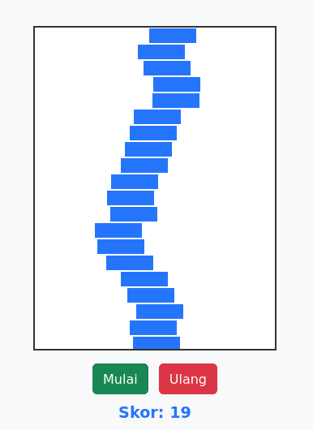

# 🧱 Block Blox

Block Blox adalah permainan tumpuk balok sederhana berbasis web. Tujuan utama dari permainan ini adalah menumpuk balok sebanyak mungkin tanpa meleset!

 

## 🎮 Fitur

- Gameplay sederhana dan adiktif
- Skor otomatis bertambah setiap balok berhasil ditumpuk
- Kecepatan meningkat secara bertahap
- Kontrol keyboard (PC) dan tombol sentuh (HP)
- Tampilan responsif dan mobile-friendly

## 📱 Kontrol

### 💻 Di Komputer:
- ⬅️ `ArrowLeft` — Gerak ke kiri
- ➡️ `ArrowRight` — Gerak ke kanan
- ⬇️ `Space` — Jatuhkan balok

### 📱 Di Ponsel:
Gunakan tombol:
- `⬅️` Gerak ke kiri
- `⬇️` Jatuhkan balok
- `➡️` Gerak ke kanan

## 🛠️ Cara Menjalankan

1. Clone atau download repositori ini:

   ```bash
   [git clone https://github.com/Project-Sekolah/Block-blox.git]
   cd block-blox

## Dibuat Oleh Rajendra
